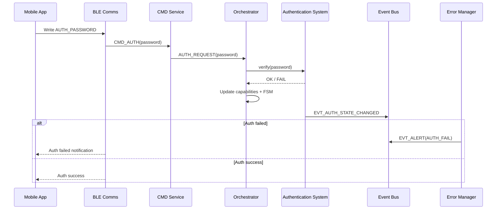
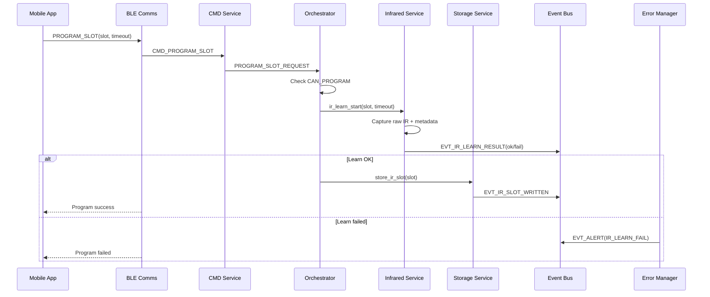
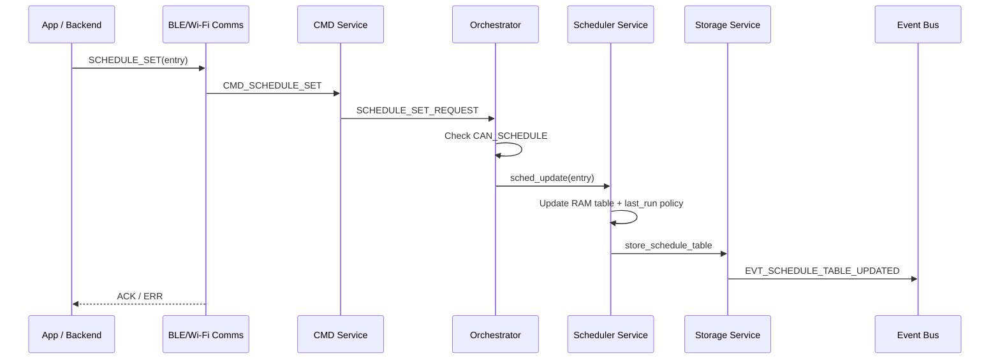
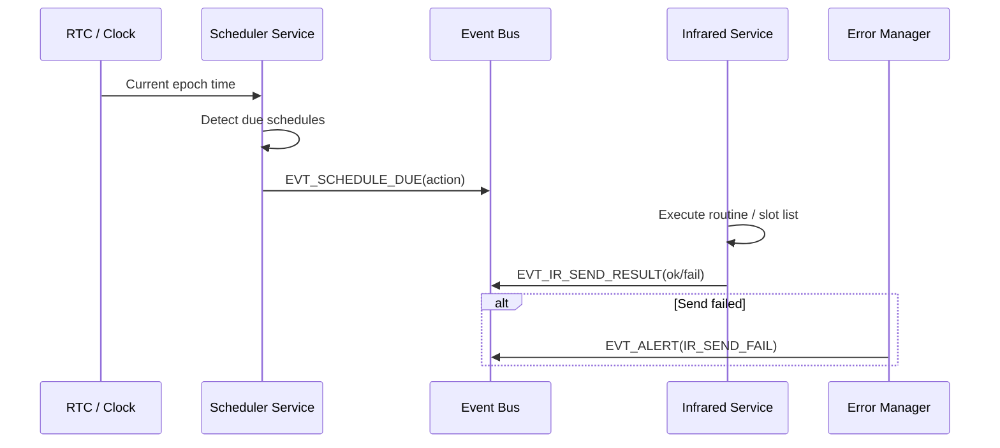
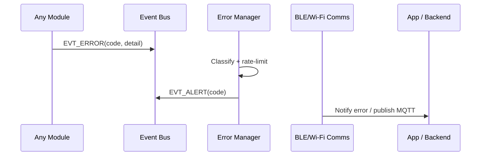

# Typical Flows

This section documents the primary end-to-end flows across modules. These flows validate ownership boundaries (Orchestrator gating, Storage single-writer, Event Bus for async events) and serve as references for implementation and test design.

---

## Flow 1: Authenticate Session (BLE)

**Goal:** Enable privileged operations (programming/scheduling) via application-level authentication.

1. Mobile App -> BLE Comms: Write `AUTH_PASSWORD` characteristic
2. BLE Comms -> CMD Service: `CMD_AUTH(password)`
3. CMD Service -> Orchestrator: `AUTH_REQUEST(password)`
4. Orchestrator -> Authentication System: `auth_verify(password)`
5. Authentication System -> Orchestrator: `OK/FAIL`
6. Orchestrator:
   - If OK: set capability flags (e.g., `CAN_PROGRAM`, `CAN_SCHEDULE`) and start auth timeout timer
   - If FAIL: keep restricted capabilities
7. Authentication System -> Event Bus: `EVT_AUTH_STATE_CHANGED(ok/fail)`
8. Error Manager (optional on fail) -> Event Bus: `EVT_ALERT(err_code)`
9. BLE Comms (subscriber) -> Mobile App: Notify auth status / error code

**Notes**
- BLE bonding/encryption is enforced before this flow (protocol-level security).
- App-level auth is a second gate; capabilities are revoked on timeout or disconnect.

---

## Flow 2: Program an IR Slot (Learn + Commit)

**Goal:** Capture raw IR data and store it atomically in slot `N`.

1. Mobile App -> BLE Comms: Write `PROGRAM_SLOT(slot=N, timeout=T)`
2. BLE Comms -> CMD Service: `CMD_PROGRAM_SLOT(N, T)`
3. CMD Service -> Orchestrator: `PROGRAM_SLOT_REQUEST(N, T)`
4. Orchestrator:
   - verify `CAN_PROGRAM`
   - transition FSM -> `PROGRAMMING_MODE`
   - disable schedule execution (policy)
5. Orchestrator -> Infrared Service: `ir_learn_start(slot=N, timeout=T)`
6. Infrared Service:
   - enable IR RX
   - capture raw data + transport metadata (len/crc/carrier/repeat)
7. Infrared Service -> Event Bus: `EVT_IR_LEARN_RESULT(slot=N, ok/fail, crc, len, err_code)`
8. Orchestrator (subscriber or direct callback):
   - if ok: request persistence
     - Orchestrator -> Storage Service: `store_ir_slot(N, header+blob)`
     - Storage Service -> Event Bus: `EVT_IR_SLOT_WRITTEN(N, ok/fail)`
   - exit `PROGRAMMING_MODE` on completion/failure/timeout
9. Error Manager -> BLE/Wi-Fi Comms: publish alert if failure
10. BLE Comms -> Mobile App: notify result

**Notes**
- IR Service owns the slot schema; Storage Service owns flash writes.
- Commit must be atomic (avoid partial slot writes).

---

## Flow 3: Add/Update a Schedule

**Goal:** Persist a schedule that triggers a routine or slot execution.

1. Mobile App or Backend -> BLE/Wi-Fi Comms: `SCHEDULE_SET(entry)`
2. Comms -> CMD Service: `CMD_SCHEDULE_SET(entry)`
3. CMD Service -> Orchestrator: `SCHEDULE_SET_REQUEST(entry)`
4. Orchestrator:
   - verify `CAN_SCHEDULE`
   - validate entry fields (basic)
5. Orchestrator -> Scheduler Service: `sched_update(entry)`
6. Scheduler Service:
   - update in-RAM schedule table
   - update table CRC/version + last_run policy
7. Scheduler Service -> Storage Service: `store_schedule_table(blob)`
8. Storage Service -> Event Bus: `EVT_SCHEDULE_TABLE_UPDATED(ok/fail, data_ver)`
9. BLE/Wi-Fi Comms -> requester: ACK/ERR

**Notes**
- Scheduler should operate from RAM; storage persistence is on update, not periodic polling.
- If time is invalid, schedule may be stored but not executed (emit warning).

---

## Flow 4: Scheduled Execution (Time -> Routine -> IR)

**Goal:** Execute an IR routine when a schedule becomes due.

1. Clock/RTC -> Scheduler Service: current epoch time available
2. Scheduler Service:
   - detect due entries (polling MVP or next-deadline timer later)
   - apply missed-run policy using `last_run`
3. Scheduler Service -> Event Bus: `EVT_SCHEDULE_DUE(schedule_id, action)`
4. Infrared Service (subscriber):
   - map action -> routine or slot list
   - transmit IR frames (with repeats/gaps)
5. Infrared Service -> Event Bus: `EVT_IR_SEND_RESULT(ok/fail, err_code)`
6. Scheduler Service:
   - update `last_run`
   - persist last_run update if required (policy)
7. Error Manager:
   - if fail: raise alert -> Comms notify user / MQTT

**Notes**
- Orchestrator may optionally gate execution based on current FSM state (e.g., block during Programming/Updating).
- Time jumps must not cause double-fire (use `last_run` + policy).

---

## Flow 5: Error Propagation (Any Module -> User)

**Goal:** Ensure consistent user-visible errors regardless of source.

1. Any module detects fault -> Event Bus: `EVT_ERROR(code, detail)`
2. Error Manager (subscriber):
   - classify severity
   - rate-limit duplicates
   - map to external error format
3. Error Manager -> Event Bus: `EVT_ALERT(code)`
4. BLE/Wi-Fi Comms (subscriber):
   - notify BLE error characteristic and/or publish MQTT

